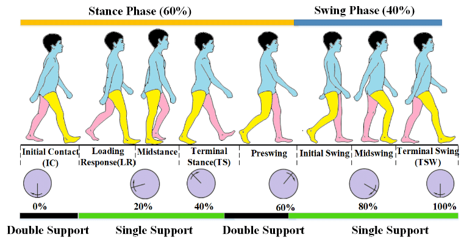
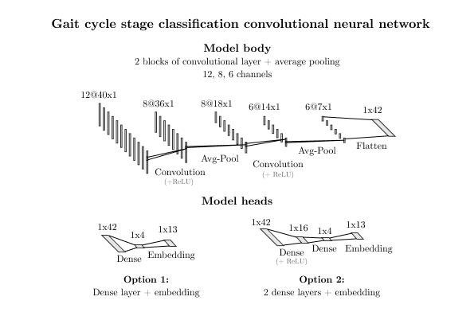
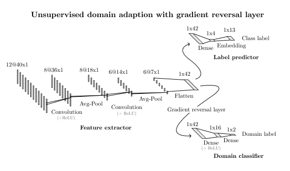
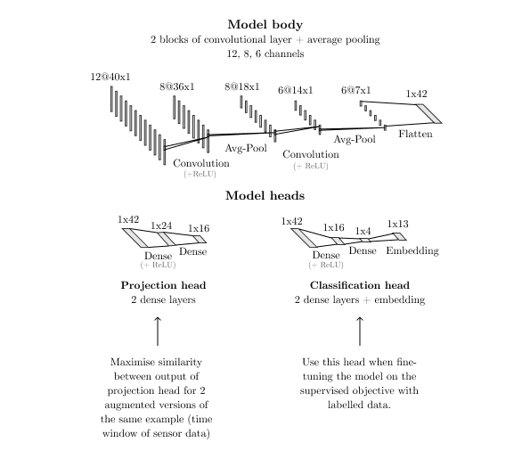
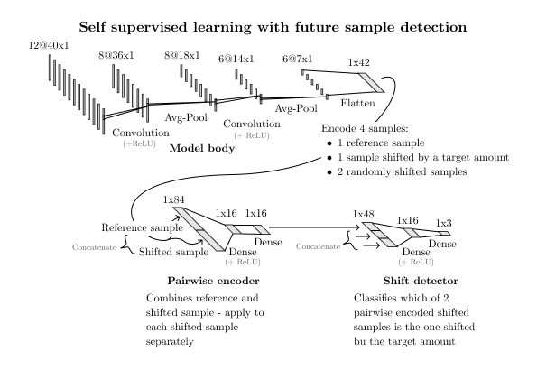
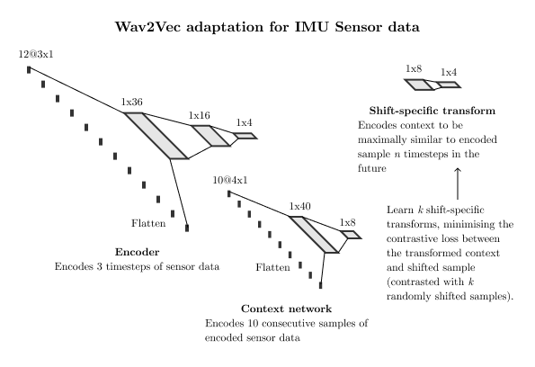
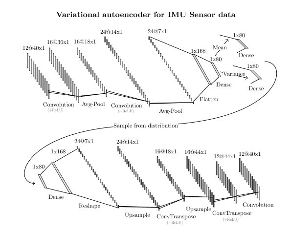

# Making efficient use of unlabelled motion data 

## Particular scenario

- Gait cycle stage classification task
- Dataset = IMU sensor data, 6 sensors (3 accelerometer + 3 gyroscope) for each leg (12 for both legs)
- Given sensor data for primary leg and secondary leg, can we classify the gait cycle stage (labelled 1 - 13) for the primary leg? (13 is a OOD label, not an actual stage)
- This task can be accomplished with reasonable accuracy using a conv net. Can we improve upon this accuracy *for a particular subject* using additional unlabelled motion data from that subject?
- Improvement could come from domain adaption (adapting the model to the particular subject) or just by introducing more (unlabelled) data and therefore training more robust features with semi-supervised techniques
- Besides improvement in average accuracy, another positive outcome would be specifically improving accuracy for "unusual" subjects such as those with severe gait pathologies. This would involve making the model more robust and general. This can be reframed as reducing performance variance between subjects.

## Sections

### Exploratory work

- [Data exploration](./data_exploration)
    - The aim of this part is to analyse the dataset and notice and significant differences between subjects
    - Some useful visualisations
- [Benchmarking of supervised model](./supervised)
    - Training a supervised-only model and benchmarking the performance for each subject
    - For each subject, a classifier (CNN) is trained using all other subjects' data and then tested on the remaining subject to obtain an approximate benchmark for the "difficulty" of that subject
    - 

### Semi-supervised training approaches

- [Adversarial domain adaption with Gradient Reversal Layer](./grl)
    - Based on the paper [Unsupervised Domain Adaptation by Backpropagation](https://arxiv.org/pdf/1409.7495.pdf)
    - Uses unlabelled data to penalise model to be able to distinguish between source and target domains, to encourage domain-invariant features
    - Result: so far doesn't seem to improve upon original supervised model, scope for more hyperparameter turning / tests on different data splits
    - Some parts of the code are adapted from https://github.com/fungtion/DANN/
    - 
  
- [Pseudolabelling based approaches](./pseudolabelling)
    - Basic version of pseudolabelling (train teacher model using labelled data, use this to "label" the unlabelled data, use the pseudolabelled data to train new classifier, fine tune final classifier using original labelled data)
    - Also implemented [Meta Pseudo Labels](https://arxiv.org/pdf/2003.10580.pdf)

- [SimCLR](./simclr)
    - Based on the paper [A Simple Framework for Contrastive Learning of Visual Representations](https://arxiv.org/pdf/2002.05709.pdf)
    - Trains the base conv net encoder using an unsupervised task of matching differently augmented versions of the same data sample, with a contrastive loss function
    - Trains an upstream classifier (2 fully connected layers + embedding) using the labelled data
    - Preliminary results show this approach allows us to reach the same accuracy with less labelled data
    - The base conv net learns a good encoding of the motion data without any labelled data, and does not require fine-tuning
    - Scope for more investigation: different augmentations, possible fine-tuning of base conv net
    - Some parts of the code are adapted from https://github.com/sthalles/SimCLR/      
    - 

- [Self supervised training with proxy task of discriminating a time window with a specific lag](./timestep_prediction)
    - Trains the model base using a pretext task and the unlabelled data, then fine-tunes using the labelled data (and a different model head) (optionally, the body weights can be frozen during this step)
    - Pretext task involves classifying which of a set of time windows is shifted by a particular time lag T
    - For example, we have a reference time window from time t = x, and additional samples from t = x + a, x + b, x + c (where a, b, c can be negative). We train a classifier to detect a shift of b and therefore return a vector `[0 1 0]` in this case (second sample is shifted by b).
    - 
      
- [Adapted version of Wav2Vec](./wav2vec)
    - Based on [Wav2Vec](https://arxiv.org/pdf/1904.05862.pdf) paper
    - Trains encoder network that encode a small number of time steps, and a context network that combines these
    - During self supervised training, a set of shift-specific networks are trained, which can be applied to the output of the context network
    - The self supervised objective maximises the similarity of the appropriately transformed context and encoded shifted sample
    - The encoder and context networks are used as the body of the supervised model, the head of which is trained using supervised training
    - 

- [Variational autoencoder](./vae)
    - Using a variational autoencoder to generate mock data
    - Can also be used to find "healthy equivalent" of patient data
    - 
  

## Comparison 

- [Comparing different approaches](./compare)
    - Runs different approaches on the same split of labelled and unlabelled subjects

## About the code

- Uses [Pytorch](https://pytorch.org/) for models
- Currently the code expects to have access to a GPU (`.cuda()` calls are scattered around) - needs refactoring to automatically detect whether an Nvidia GPU is available and run on CPU if not
- Assumes data is location in directory `data/` relative to the project base directory
- Most scripts output some logs
- Mixture of jupyter notebooks and `.py` files
- Setup a virtual environment and then run `pip install -r requirements.txt` to install requirements